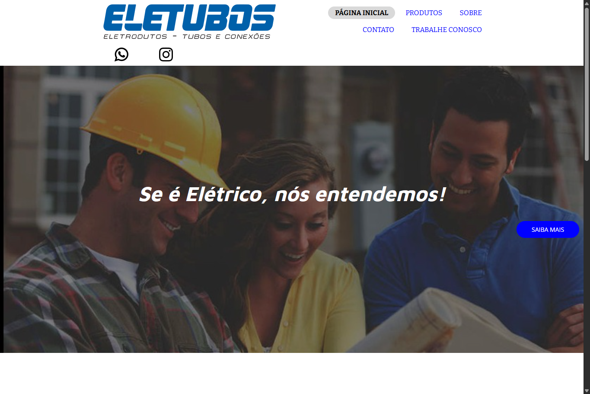
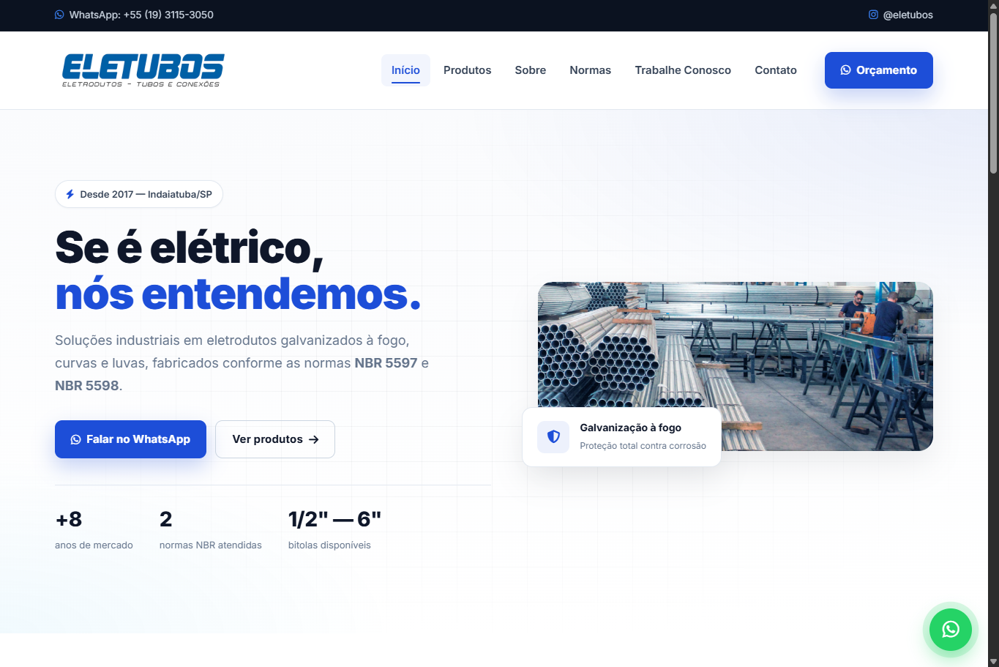

# 🛠️ Eletubos – Projeto de Front-end

# ⚡ Eletubos - Redesign do Site

## 📌 Sobre

Este projeto consiste no **redesign do site da Eletubos**, com foco em melhorar a aparência visual, organização das informações e experiência do usuário.

---

## 🔄 Antes e Depois

  
  

  <i>Comparação do site original com o novo design desenvolvido.</i>

---

## 🔗 Links

- 🌐 Site original: https://eletubos.com.br  
- 🚀 Novo design: https://SEU-LINK-AQUI

## 📌 Sobre o projeto

O **Eletubos** é um projeto em desenvolvimento com foco em modernizar o site da empresa onde trabalho.  
A ideia é dar uma **repaginada visual no front-end**, deixando o site mais moderno, responsivo e agradável para os usuários.

Esse repositório contém a estrutura inicial de páginas em **HTML, CSS e JavaScript**.

---

## 🚀 Funcionalidades atuais

✔️ Página principal  
✔️ Páginas internas de produtos, normas, contato e carreira  
✔️ Estilo personalizado com CSS  
✔️ Organização de arquivos por pastas (`css`, `js`, `img`)

---

## 🛠️ Tecnologias

  
  

---

## 📍 Visualizar o projeto

Você pode acessar a versão publicada aqui:  
👉 🌐 https://emerson-o-campos.github.io/eletubos/

---

